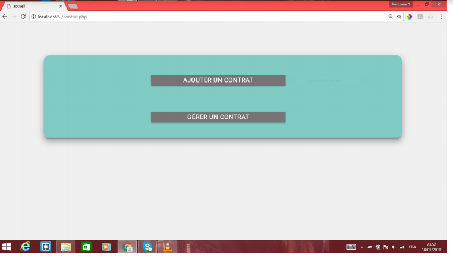
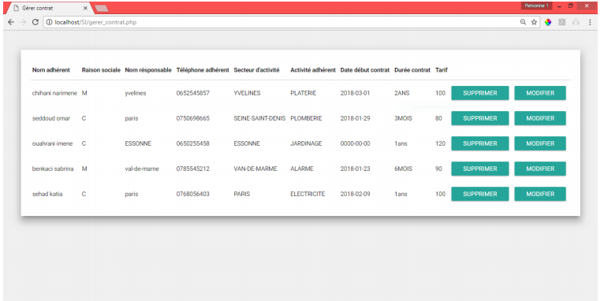
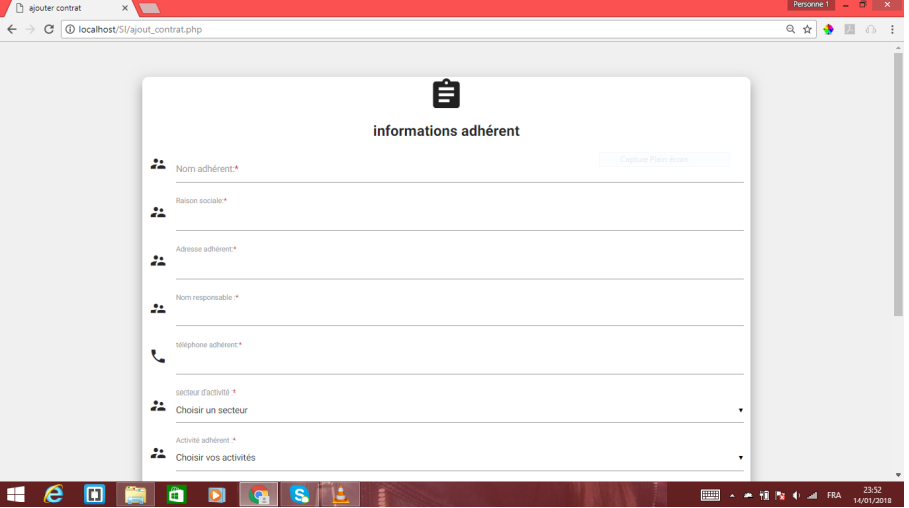
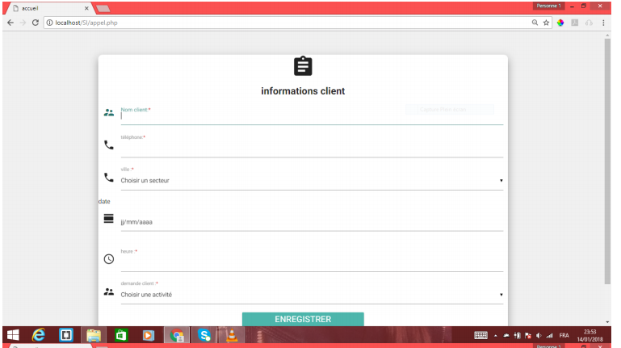
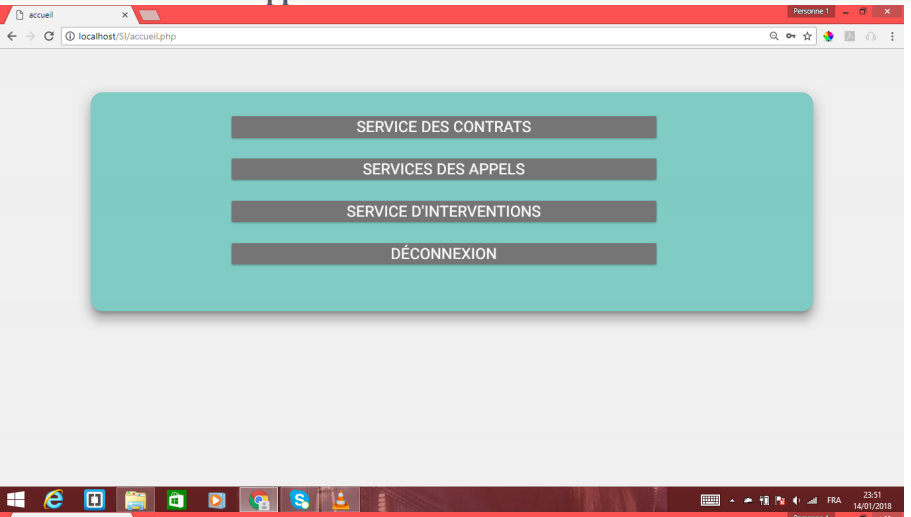
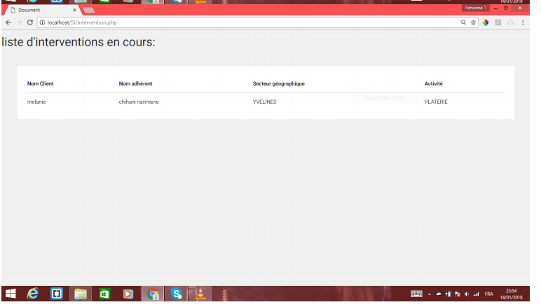
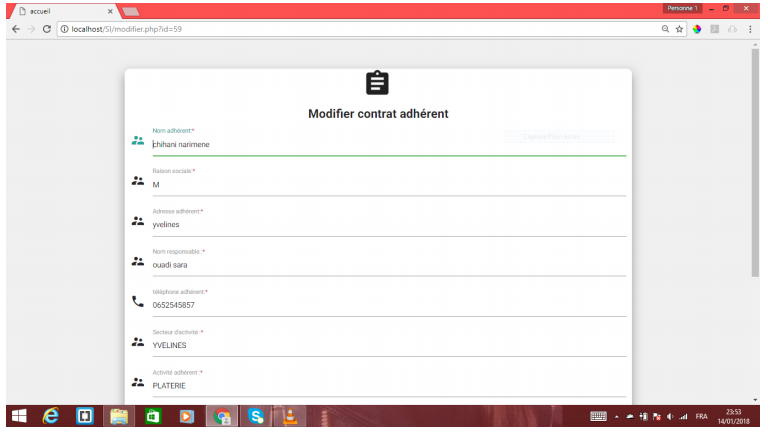

# Application_Adher

## Gestion d’ADHER
La société ADHER est un groupement d’adhérents, elle propose pour ses
futurs adhérents dans le cadre d’un contrat de promouvoir leur action commerciale.
Pour cela la société ADHER lance pour le compte de ses adhérents des compagnes
publicitaires pour informer le public sur les prestations proposées. Pour répondre à la
demande des services de ses clients, la société ADHER transmet la demande à ses
adhérents, ces derniers répondent à cette demande et enfin la société ADHER répond
à ses clients. 

__Technologies utilisées : HTML5/CSS3, javaScript, PHP.__

# Overview

## Accueil

## Gestion des contrats

## Informations adherent

## Informations client

## Interface delapplication.PNG

## Liste intervenants

## Modifier contrat adherent

_Réalisé en Janvier 2018_
